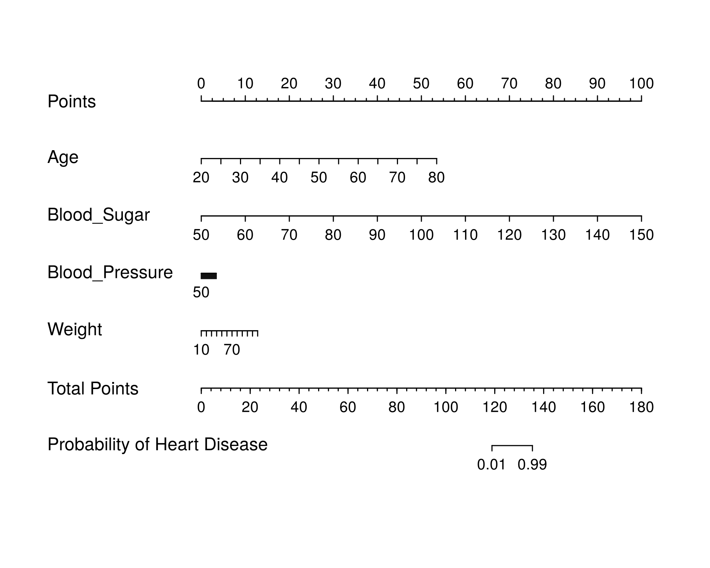

# R-Executor

**Other Language Version: [English](README.md), [中文](README_zh.md).**

Author: AFAN (WeChat: afan-life)

R-Executor is a Docker-based R language execution environment that integrates the R runtime and a Python Flask service. Through HTTP requests, users can send R code to the r-executor container for execution and retrieve the results. This project aims to provide a cross-platform R language invocation solution, simplifying the remote execution of R code and result retrieval.

## Features
- **Flask Integration**: Embeds a Flask service into the R Docker environment, creating a remotely callable R execution service.
- **Data Type Conversion**: Utilizes `rpy2` to convert R data types into standard Python data types, enabling HTTP-based result parsing.

## Directory Structure

```
- app.py               # Flask service entry point
- config.py            # Global configuration file
- Dockerfile           # Docker image build file
- requirements.txt     # Python dependency list for building the image
- r_packages.txt       # R dependency list for building the image
- compose.yaml         # Docker Compose configuration file
- test/                # Test cases
  - test0_local.py     # Test R code execution inside the container
  - test1_basic.py     # Test client requests to retrieve R data types
  - test2_lrm.py       # Test client requests to call the lrm function from the rms package for logistic regression
  - test3_plot.py      # Test client requests to generate and save a nomogram plot
- train.csv            # Dataset used for test cases
- nom.png              # Output of test3_plot.py (nomogram plot)
```


## Usage

### Get the Image

#### Pulling the Image from Docker Hub

The r-executor image is available on Docker Hub. You can pull it directly using the following command:

```bash
docker pull afanlife/r-executor
```

Image URL：https://hub.docker.com/r/afanlife/r-executor

The r-executor image comes pre-installed with `Python 3.13.2` and `R 4.4.2`, along with the default Python and R dependencies listed in `requirements.txt` and `r_packages.txt`. If the current version meets your needs, you can directly pull the image from Docker Hub.

**Note**: The `app.py` in r-executor is executed within the container via volume mounting, allowing direct modifications without rebuilding the image.

#### Rebuilding the Image

If the default version does not meet your requirements, you can rebuild the image as needed:
- To change the Python or R version, modify the `Dockerfile`.
- To adjust Python or R dependencies, modify `requirements.txt` and `r_packages.txt`.

```bash
docker build -t r-executor:1.0 .
```

Commands for exporting and loading the image:

```bash
docker save -o r-executor.tar r_executor
docker load -i r-executor.tar
```

### Starting the Container

Map all files in the current directory to the `/app` directory inside the container and start the service.

Manual Start

```bash
docker run -it -p 5000:5000 -v .:/app afanlife/r-executor /bin/bash
python app.py
```

Using Docker Compose

```bash
docker compose up
```

## Test Cases

### Starting `app.py`

```
root@9f2585313bab:/app# Python app.py
3.5.17
 * Serving Flask app 'app'
 * Debug mode: on
WARNING: This is a development server. Do not use it in a production deployment. Use a production WSGI server instead.
 * Running on all addresses (0.0.0.0)
 * Running on http://127.0.0.1:5000
 * Running on http://172.17.0.2:5000
Press CTRL+C to quit
 * Restarting with stat
```

Running `test1_basic.py` (Testing Basic Data Types)

```
{
  "data": {
    "dataframe": {
      "a": [
        1.0,
        2.0
      ],
      "b": [
        "x",
        "y"
      ]
    },
    "matrix": [
      1,
      2,
      3,
      4
    ],
    "vector": [
      1.0,
      2.0,
      3.0
    ]
  },
  "message": "R code run success",
  "status": "success"
}
```

Running `test2_lrm.py` (Testing Logistic Regression Model)

```
{
  "data": {
    "accuracy": [
      0.991
    ],
    "model_summary": [
      "Logistic Regression Model",
      "",
      "lrm(formula = Heart_Disease ~ ., data = r_df)",
      "",
      "                       Model Likelihood     Discrimination    Rank Discrim.    ",
      "                             Ratio Test            Indexes          Indexes    ",
      "Obs          1000    LR chi2     238.07     R2       0.859    C       0.997    ",
      " 0            968    d.f.             4    R2(4,1000)0.209    Dxy     0.994    ",
      " 1             32    Pr(> chi2) <0.0001    R2(4,92.9)0.919    gamma   0.994    ",
      "max |deriv| 2e-05                           Brier    0.007    tau-a   0.062    ",
      "",
      "               Coef      S.E.    Wald Z Pr(>|Z|)",
      "Intercept      -109.6707 24.8000 -4.42  <0.0001 ",
      "Age               0.4953  0.1116  4.44  <0.0001 ",
      "Blood_Sugar       0.5558  0.1228  4.52  <0.0001 ",
      "Blood_Pressure    0.0135  0.0213  0.63  0.5270  ",
      "Weight            0.0647  0.0307  2.11  0.0352  ",
      ""
    ]
  },
  "message": "R code run success",
  "status": "success"
}
```

Running `test3_plot.py` (Testing Plot Generation and Saving)



## References

- [r-base Image Build](https://github.com/rocker-org/rocker/tree/master/r-base)